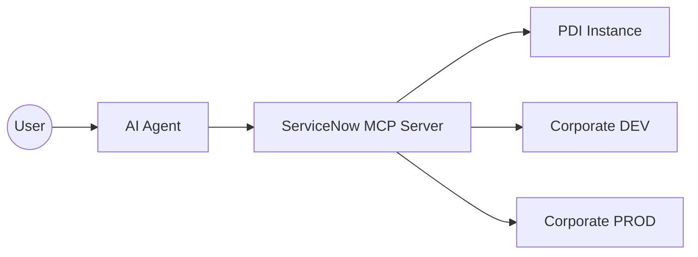

# ServiceNow MCP Server 🚀

[](https://github.com/jeffersonrmoraes/servicenow-mcp/releases)
[](https://www.servicenow.com)
[](https://modelcontextprotocol.io)

O **ServiceNow MCP Server** é um conector de alta performance que permite que agentes de IA (Claude, Copilot, Antigravity) desenvolvam e gerenciem instâncias do ServiceNow diretamente via APIs nativas. 

**🎉 v3.0: Refatoração de Consolidação** — Reduzimos a complexidade unificando ferramentas redundantes em Gerenciadores de Domínio (ex: `sn_manage_acl`).

---

## 🏛️ Arquitetura Multi-Instância

O servidor suporta conexão simultânea com múltiplos ambientes (DEV, TEST, PDI, PROD) através de prefixos nas variáveis de ambiente.



---

## 🚀 Como Começar

### 1. Requisitos
- Node.js ≥ 18
- Credenciais de uma instância ServiceNow (Basic Auth)

### 2. Instalação Local
```bash
git clone https://github.com/jeffersonrmoraes/servicenow-mcp.git
cd servicenow-mcp
npm install
cp .env.example .env   # preencha com suas credenciais
node index.js          # ServiceNow MCP Server v3.0.0 rodando — 25 ferramentas consolidadas
```

---

## 🛠️ Ferramentas Disponíveis (v3.0)

### 🧩 Core CRUD (Qualquer Tabela)
| Ferramenta | Descrição |
|---|---|
| `sn_query_records` | Consulta registros com query e filtros |
| `sn_get_record` | Busca um registro específico pelo sys_id |
| `sn_create_record` | Cria registro genérico (campos nativos) |
| `sn_update_record` | Atualiza registro genérico pelo sys_id |
| `sn_delete_record` | Remove registro de qualquer tabela |

### 📜 Desenvolvimento & Metadados
| Ferramenta | Descrição |
|---|---|
| `sn_upsert_metadata_script` | **NOVO**: Cria/Atualiza Business Rules, Script Includes, Client Scripts, UI Policies e Jobs |
| `sn_execute_script` | Executa Background Scripts (Server-Side) |
| `sn_manage_schema` | **NOVO**: Cria tabelas e campos customizados |

### 🛡️ Segurança & Acesso
| Ferramenta | Descrição |
|---|---|
| `sn_manage_acl` | **CONSOLIDADO**: Cria, atualiza, remove e gere roles de ACLs |
| `sn_manage_notification` | **CONSOLIDADO**: Gestão completa de Notificações de Email |
| `sn_manage_access` | **CONSOLIDADO**: Gestão de Roles, Grupos e Acessos de Usuários |

### 📦 Catálogo & Fluxo
| Ferramenta | Descrição |
|---|---|
| `sn_manage_catalog_item` | **CONSOLIDADO**: Cria e atualiza Catalog Items |
| `sn_manage_catalog_variable` | **CONSOLIDADO**: Cria e atualiza Variáveis de Catálogo |
| `sn_manage_catalog_category` | Cria/Atualiza categorias de catálogo |
| `sn_get_flow` | Busca um Flow pelo nome ou sys_id |
| `sn_trigger_flow` | Dispara um Flow manualmente |

### 📎 Outros
| Ferramenta | Descrição |
|---|---|
| `sn_upload_attachment` | Upload de arquivos via Base64 |
| `sn_download_attachment` | Download de arquivos como Base64 |
| `sn_set_sys_property` | Upsert de System Properties |
| `sn_create_update_set` | Criação de Update Sets |

---

## 📈 Changelog

| Versão | Data | O que mudou |
|---|---|---|
| **v3.0.0** | 2026-03-27 | 🏗️ **Grande Refatoração** — Consolidação de ~55 ferramentas em ~25. Melhora drástica na gestão de tokens e clareza para a IA. Introdução do padrão `sn_manage_*`. |
| v2.3.0 | 2026-03-27 | ⚙️ System Properties — `sn_get_sys_property`, `sn_set_sys_property`. |
| v2.2.0 | 2026-03-27 | 📎 Attachment API — `sn_upload_attachment`, `sn_download_attachment`. |
| v2.1.0 | 2026-03-27 | 🌐 Suporte Multi-Instância Dinâmico. |

---

## ⚠️ Regras para Desenvolvedores
Se você é uma IA trabalhando neste repositório, **leia o [GEMINI.md](file:///c:/servicenow-mcp/servicenow-mcp/GEMINI.md)** para entender as convenções e padrões de código antes de enviar um PR.
