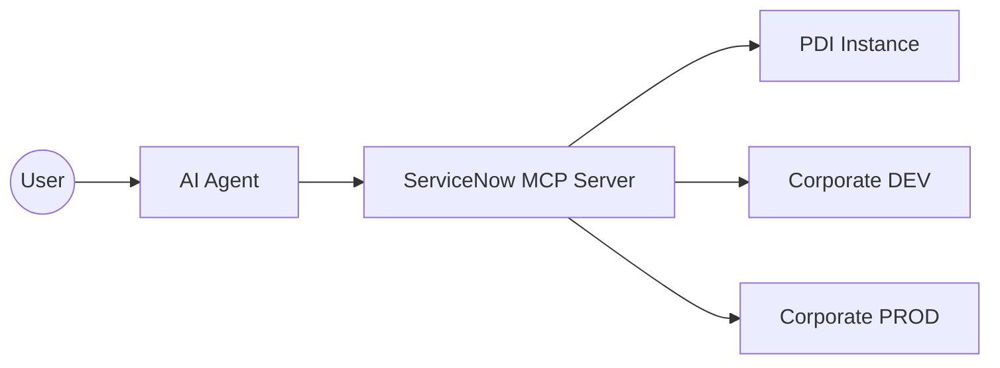

# ServiceNow MCP Server 🚀

O **ServiceNow MCP Server** é um conector de alta performance que permite que agentes de IA (Claude, Copilot, Antigravity) desenvolvam e gerenciem instâncias do ServiceNow diretamente via APIs nativas. 

**🎉 v3.1: Front-end Revolution** — Adicionamos suporte nativo para Service Portal Widgets e UI Actions complexas.

---

## 🏛️ Arquitetura Multi-Instância

O servidor suporta conexão simultânea com múltiplos ambientes (DEV, TEST, PDI, PROD) através de prefixos nas variáveis de ambiente.

---

## 🛠️ Ferramentas Disponíveis (v3.1)

### 🧩 Core CRUD (Qualquer Tabela)
| Ferramenta | Descrição |
|---|---|
| `sn_query_records` | Consulta registros com query e filtros |
| `sn_get_record` | Busca um registro específico pelo sys_id |
| `sn_create_record` | Cria registro genérico (campos nativos) |
| `sn_update_record` | Atualiza registro genérico pelo sys_id |
| `sn_delete_record` | Remove registro de qualquer tabela |

### 🎨 Front-end & UX (NOVO v3.1)
| Ferramenta | Descrição |
|---|---|
| `sn_manage_widget` | **NOVO**: Cria/Atualiza Service Portal Widgets (HTML, CSS, Server/Client Scripts) |
| `sn_manage_ui_action` | **NOVO**: Cria/Atualiza botões, links e menus de formulário |
| `sn_manage_ui_page` | **NOVO**: Gestão de UI Pages customizadas (XML/Jelly) |

### 📜 Desenvolvimento & Metadados
| Ferramenta | Descrição |
|---|---|
| `sn_upsert_metadata_script` | Cria/Atualiza Business Rules, Script Includes, Client Scripts, UI Policies e Jobs |
| `sn_execute_script` | Executa Background Scripts (Server-Side) |
| `sn_manage_schema` | Cria tabelas e campos customizados |

### 🛡️ Segurança & Acesso
| Ferramenta | Descrição |
|---|---|
| `sn_manage_acl` | Gestão completa de ACLs e suas roles associadas |
| `sn_manage_notification` | Gestão completa de Notificações de Email |
| `sn_manage_access` | Gestão de Roles, Grupos e Acessos de Usuários |

---

## 📈 Changelog

| Versão | Data | O que mudou |
|---|---|---|
| **v3.1.0** | 2026-03-27 | 🎨 **Front-end Revolution** — Adicionado suporte consolidado para Service Portal Widgets, UI Actions e UI Pages. |
| v3.0.0 | 2026-03-27 | 🏗️ **Grande Refatoração** — Consolidação de ~55 ferramentas em ~25. Introdução do padrão `sn_manage_*`. |
| v2.3.0 | 2026-03-27 | ⚙️ System Properties — `sn_get_sys_property`, `sn_set_sys_property`. |

---

## ⚠️ Regras para Desenvolvedores
Se você é uma IA trabalhando neste repositório, **leia o [GEMINI.md](file:///c:/servicenow-mcp/servicenow-mcp/GEMINI.md)** para entender as convenções e padrões de código antes de enviar um PR.
